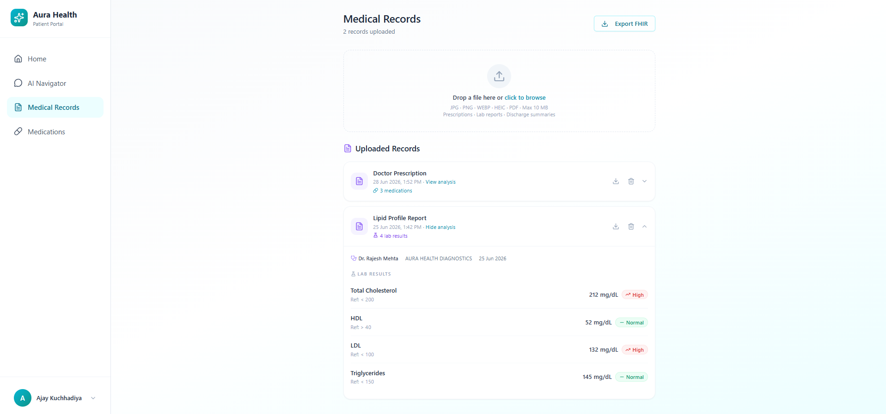
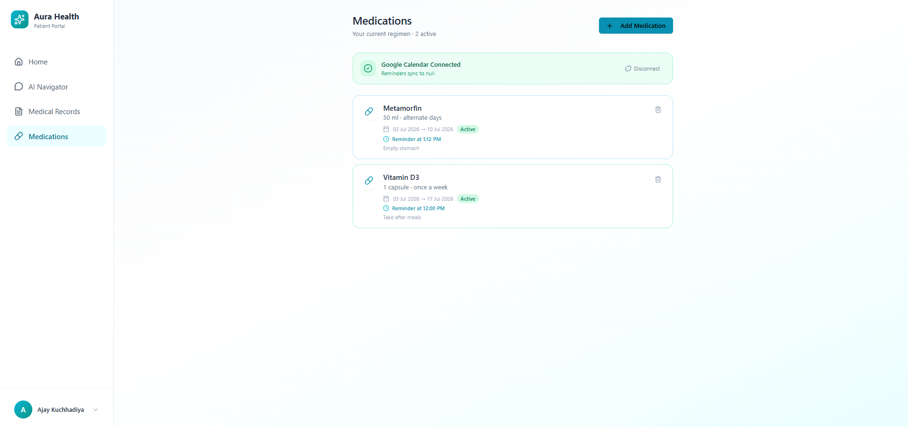
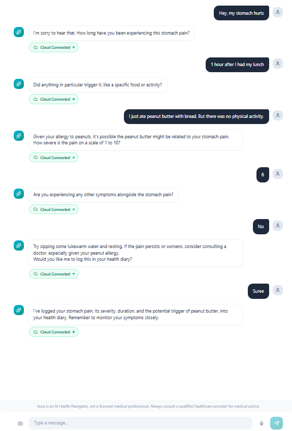

# Aura Health — Backend

> A **Personal Digital Twin** API that powers Aura, an AI health navigator for patients with chronic illnesses.

### [🌐 Try the Live App →](https://aura-health-frontend-five.vercel.app)

[](https://aura-health-backend-2xhl.onrender.com/health)
[](https://aura-health-backend-2xhl.onrender.com/docs)

Built with **FastAPI**, **PostgreSQL (Supabase)**, and **Google Gemini 2.5 Flash**. Aura helps patients understand their medical data, track lab trends, manage medications, and stay adherent to their treatment plans — all through a personalized AI conversation.

---

## Screenshots

| Medical Records & Lab Tracking | Medications & Calendar |
|---|---|
|  |  |

---

## What is a Digital Twin?

Each patient gets a **Digital Twin** — a live JSONB document holding their full medical profile: chronic conditions, allergies, current medications, lab history, and daily health logs. Every Aura session is seeded with this profile, so the AI always has complete context without the user repeating themselves.

---

## Features

| Feature | Details |
|---|---|
| **Aura AI Navigator** | Conversational health agent powered by Gemini 2.5 Flash via Google ADK — medical translator, lab-trend analyst, and adherence coach. |
| **Digital Twin Profile** | Full patient medical history stored as JSONB and injected into every AI session as live context. |
| **Health Record Upload** | Upload prescription images or lab-report PDFs (up to 10 MB). Gemini reads files natively (multimodal) and extracts medications, dosages, diagnoses, and lab results. |
| **Lab Result Tracking** | Structured lab results stored per-upload and surfaced on the dashboard with trend indicators. |
| **Medication Management** | Full CRUD for a patient's medication regimen with drug interaction checking via the RxNav API. |
| **Google Calendar Reminders** | Connect Google Calendar via OAuth. Aura schedules recurring medication reminder events directly on the patient's calendar. |
| **Doctor Profiles** | Doctors create profiles with specialty, qualifications, and availability. Patients browse by specialty. |
| **FHIR Export** | Export patient data as a FHIR R4 Bundle (JSON) for portability. |
| **Firebase Auth** | Stateless Bearer-token authentication — no session state on the server. |

---

## Tech Stack

| Layer | Technology |
|---|---|
| Framework | FastAPI (async) |
| Database | PostgreSQL via Supabase — SQLAlchemy (async) + asyncpg |
| AI Agent | Google ADK + Gemini 2.5 Flash |
| Auth | Firebase Admin SDK |
| File Storage | Supabase Storage |
| Drug Interactions | RxNav API (NIH) |
| Deployment | Render (Docker) + GitHub Actions CI/CD |

---

## Aura AI Navigator

Aura is a **Medical Record Analyst and Adherence Coach** built on Google ADK + Gemini 2.5 Flash. It is seeded with the patient's Digital Twin on every session.

### Personalized, Context-Aware Responses

Aura reads the patient's known conditions and allergies directly from their Digital Twin. In the example below, the user mentions eating peanut butter — Aura immediately connects this to their documented **peanut allergy**, asks the right follow-up questions, and then offers to log the episode into their health diary. The user confirms, and Aura writes the entry automatically.



### What Aura Can Do

| Capability | Description |
|---|---|
| **Medical Translator** | Explains lab results, prescriptions, and medical documents in plain, empathetic language. |
| **Lab Trend Analyst** | Identifies whether values like HbA1c or cholesterol are improving or worsening and suggests questions for the patient's doctor. |
| **Adherence Coach** | Helps users stay on top of medication schedules and creates Google Calendar reminder events on their behalf. |
| **Health Diary** | Gathers context through conversation, then logs symptoms, mood, vitals, or other updates directly into the Digital Twin. |
| **Appointment Prep** | Builds structured question lists based on recent lab trends and medication changes before a doctor visit. |

### Agent Tools

| Tool | Description |
|---|---|
| `log_health_update` | Logs a daily health entry (symptoms, vitals, mood, weight, etc.) into the patient's `daily_logs`. |
| `create_calendar_event` | Creates a recurring medication reminder on the user's connected Google Calendar. |

---

## Architecture

```
Client (React)
    │  Bearer token (Firebase)
    ▼
FastAPI  ──► Firebase Admin SDK (auth)
    │
    ├── PostgreSQL (Supabase)    ← Digital Twin, medications, lab results, calendar tokens
    ├── Supabase Storage         ← Uploaded health record files
    │
    └── AuraAgentService (Google ADK)
            └── Gemini 2.5 Flash
                    ├── log_health_update      → direct DB write
                    └── create_calendar_event  → Google Calendar API
```

---

## Local Development

### Prerequisites

- Python 3.11+
- [Supabase](https://supabase.com) project (free tier works)
- Firebase project with a service account key
- Google Cloud project with the Calendar API enabled

### Setup

```bash
git clone https://github.com/YOUR_GITHUB_USERNAME/aura-health-backend.git
cd aura-health-backend

python -m venv .venv
source .venv/bin/activate        # Windows: .venv\Scripts\Activate.ps1

pip install -r requirements.txt

cp .env.example .env             # fill in your values

alembic upgrade head

uvicorn app.main:app --reload --port 8000
```

Open [http://localhost:8000/docs](http://localhost:8000/docs) for the interactive API docs.

> **Supabase Storage:** Create a bucket named `health-records` (set to Public) in your Supabase dashboard. The backend uploads files automatically on `POST /api/v1/health-records/upload`.

---

## Deployment

Auto-deploys to [Render](https://render.com) on every push to `main` via GitHub Actions.

```
Push to main
    ↓
GitHub Actions  →  install deps, smoke test
    ↓ (on pass)
Render Deploy Hook  →  build Docker image  →  alembic upgrade head  →  live
```

**First-time setup:** Create a Web Service on Render (Docker runtime), add environment variables, then store the Render Deploy Hook URL as a GitHub Actions secret named `RENDER_DEPLOY_HOOK_URL`.

---

## License

[MIT](./LICENSE)

